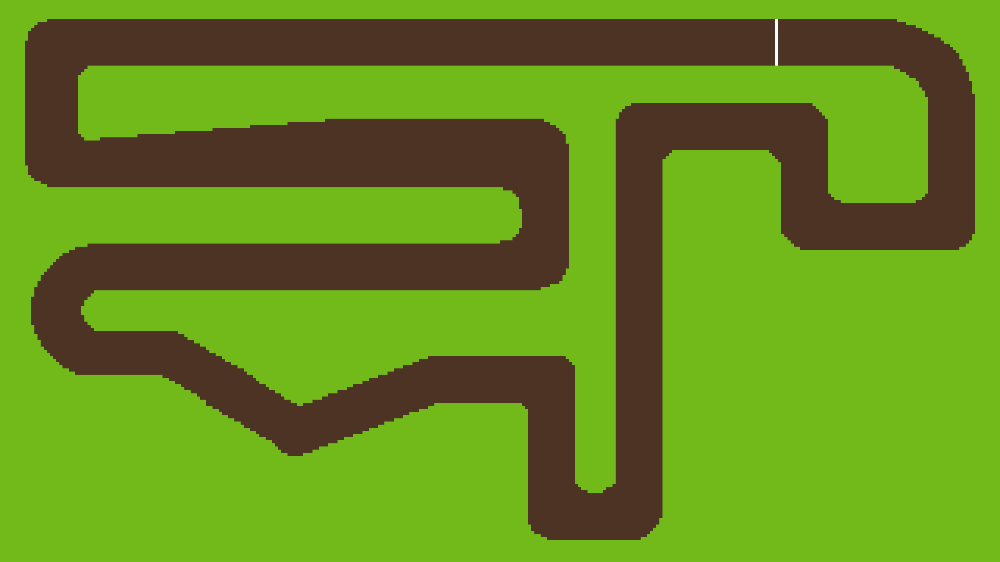
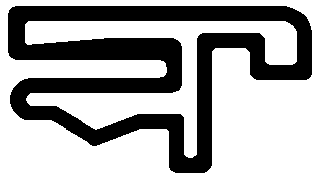
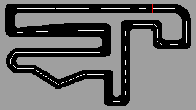

# f1-driver

A top-down racing simulator in Python. Drive on custom circuits, tune your car physics, and record cryptographically signed lap times.

Read the blogpost on <a href="https://www.ekanshgoenka.com/projects/f1-driver/f1-driver-the-story/">my website</a>

<table>
  <tr>
    <td></td>
    <td></td>
  </tr>
  <tr>
    <td></td>
    <td></td>
  </tr>
</table>

## DEMO VIDEOS


https://github.com/user-attachments/assets/499fdbb9-c980-4e8d-aefd-d6083af5de17

https://github.com/user-attachments/assets/e4e8bdca-6612-42a9-a8dd-bb48eceeb83d


## Features

- **Custom tracks** with a built-in track switcher
- **Tunable car physics** (acceleration, braking, grip, top speed) from an in-game params menu
- **Lap timer** with automatic finish-line detection
- **Signed lap times** using HMAC-SHA256, shareable and verifiable by anyone with the key
- **Camera modes** (follow cam, fixed, full rotated, zoom levels)
- **Per-lap telemetry** recording and graphs

## Controls

| Key | Action |
|-----|--------|
| W / A / S / D | Accelerate / steer left / brake / steer right |
| Space | Pause |
| R | Reset to start |
| F | Cycle camera mode |
| T + Arrow Keys | Track switcher |
| Tab | HUD switcher |
| P | Car params menu |
| G + Arrow Keys | Lap graphs |
| L | Signed laps panel |
| V | Verify a lap string |

## Signed Lap Times

Every lap completed with default car params gets signed automatically with HMAC-SHA256 and stored in the laps panel.

The signed string looks like:

```
01:23.456,circuitiolompyia a3f9c2...
```

Press `L` to open the panel and copy a lap. Press `V` to verify any signed string (paste it in, hit Enter). The verifier confirms the lap time and track name. Laps with modified car params are tagged `[unofficial]`.

The key lives in `key.py` which is gitignored. In a real competitive setting it would live server-side.

## Install (macOS)

```bash
brew install Ekansh38/f1-driver/f1-driver
f1-driver
```

## Setup (from source)

```bash
python3 -m venv venv
source venv/bin/activate
pip install -r requirements.txt
python main.py
```

Requires Python 3.11+ and pygame-ce (not vanilla pygame).

## Adding Tracks

**From source:** drop your track folder into `tracks/`. The in-game switcher picks it up automatically.

**Homebrew install:** drop your track folder into:
```
~/Library/Application Support/f1-driver/tracks/
```
The directory is created automatically on first run and survives `brew upgrade`.

---

## Creating a Custom Track

Drop a folder into `tracks/` (source) or `~/Library/Application Support/f1-driver/tracks/` (Homebrew) and the game picks it up automatically. Waypoints are extracted on first launch, no scripts needed.

Each track folder needs four files:

```
my-track/
├── bg.png           <- what the player sees (full resolution)
├── track_mask.png   <- collision map (low resolution)
├── track_data.png   <- center line + start line (low resolution)
└── track.json       <- a few settings
```

---

### Pick a preset

The game window is always **1280x720**. Tracks smaller than that use a fixed overhead camera. Tracks larger than that automatically switch to follow cam so the car stays visible.

| Preset | Camera | Low-res canvas | bg.png | internal_res |
|--------|--------|---------------|--------|--------------|
| Small / fixed | Fixed overhead | 160x90 | 1280x720 | 8 |
| Medium | Follow cam | 320x180 | 2560x1440 | 8 |
| Large | Follow cam | 640x360 | 2560x1440 | 4 |

**Small / fixed:** the whole track is visible at once, no camera movement. Good for tight, technical layouts. Like Green Roads.

**Medium:** the camera follows the car around a larger world. Good for flowing circuits. Like Circuiti Olompyia.

**Large:** even more track real-estate. Use `internal_res: 4` to keep file sizes reasonable.

Use a **pixel art editor** for the low-res files (mask and data). Recommended: [Aseprite](https://www.aseprite.org/) (paid, best), [Pixelorama](https://orama-interactive.itch.io/pixelorama) (free), [LibreSprite](https://libresprite.github.io/) (free Aseprite fork). For `bg.png` use any editor since it's full resolution.

---

### The three image files

#### `bg.png` (what the player sees)

The visible track (surface, kerbs, run-off, background). Draw it at the full-res size from your chosen preset (e.g. 1280x720 for a small track, 2560x1440 for medium).

Here is what one looks like:



---

#### `track_mask.png` (collision)

Draw this at the **low-res canvas size** from your preset (e.g. 160x90 for small). Two colors only:

| Color | Meaning |
|-------|---------|
| Black `#000000` | Driveable surface |
| White `#ffffff` | Off-track |

Here is what one looks like (these are tiny images, zoomed in):



---

#### `track_data.png` (center line and start line)

Also at the **low-res canvas size**. Two colors:

| Color | Meaning |
|-------|---------|
| White `#ffffff` | Center line: trace it all the way around the track so it loops |
| Red `#ff0000` | Start / finish line: a short crossbar across the track |

Everything else in this file is ignored.

Here is what one looks like:



Paint the white line one pixel wide, following the racing line through every corner. The start line is just a few red pixels; the game averages their position so it doesn't need to be exact.

---

### `track.json`

```json
{
  "name": "My Circuit",
  "internal_res": 8,
  "background_color": "#71ba1a",
  "spawn_x": 10,
  "spawn_y": 10,
  "spawn_angle": -90
}
```

| Field | Description |
|-------|-------------|
| `name` | Track name in the switcher and on signed lap strings |
| `internal_res` | Scale factor between low-res canvas and full-res world. Match your preset above. |
| `background_color` | Hex color shown outside the world bounds |
| `spawn_x` / `spawn_y` | Car start position in **low-res pixels** |
| `spawn_angle` | `0` = up, `90` = left, `-90` = right, `180` = down |

---

### Quick checklist

- [ ] `bg.png` is at full resolution for your preset (e.g. 1280x720 or 2560x1440)
- [ ] `track_mask.png` and `track_data.png` are at the low-res canvas size (e.g. 160x90 or 320x180)
- [ ] `track_mask.png` uses only black (driveable) and white (off-track)
- [ ] `track_data.png` has a white center line that loops all the way around
- [ ] `track_data.png` has a small red crossbar for the start/finish line
- [ ] `spawn_x` / `spawn_y` land on a black pixel in `track_mask.png`

Drop the folder in and launch. Waypoints are extracted automatically on first load.
