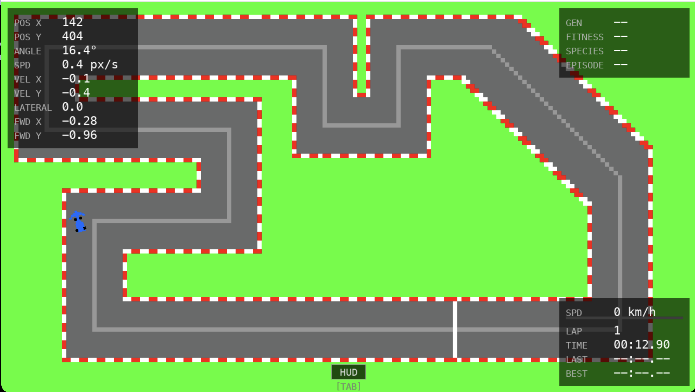
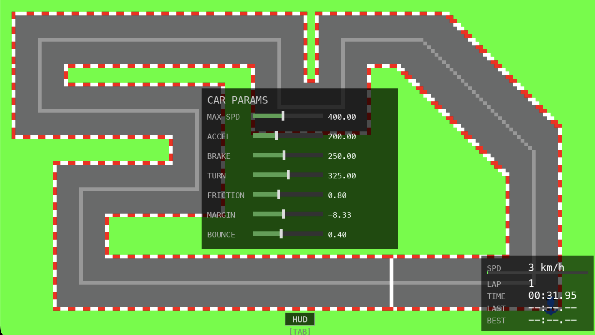
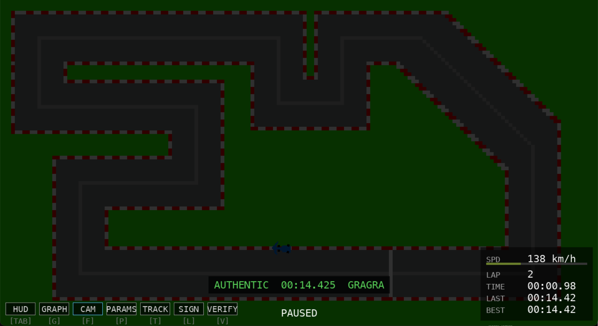
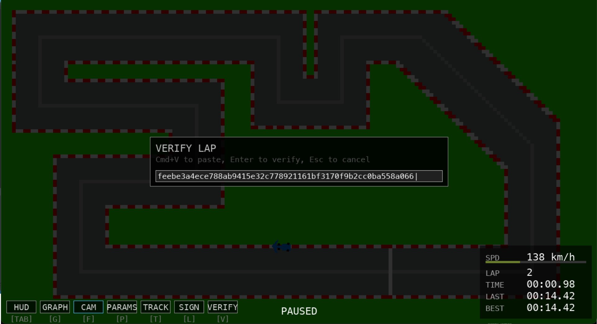

# f1-driver

A top-down racing simulator in Python. Drive on custom circuits, tune your car physics, and record cryptographically signed lap times.

<table>
  <tr>
    <td></td>
    <td></td>
  </tr>
  <tr>
    <td></td>
    <td></td>
  </tr>
</table>

## DEMO VIDEOS


https://github.com/user-attachments/assets/499fdbb9-c980-4e8d-aefd-d6083af5de17

https://github.com/user-attachments/assets/e4e8bdca-6612-42a9-a8dd-bb48eceeb83d


## Features

- **Custom tracks** with a built-in track switcher
- **Tunable car physics** (acceleration, braking, grip, top speed) from an in-game params menu
- **Lap timer** with automatic finish-line detection
- **Signed lap times** using HMAC-SHA256. Lap strings are shareable and verifiable by anyone with the key
- **Camera modes**: follow cam, fixed, full rotated, zoom levels
- **Per-lap telemetry** recording and graphs

## Controls

| Key | Action |
|-----|--------|
| W / A / S / D | Accelerate / steer left / brake / steer right |
| Space | Pause |
| R | Reset to start |
| F | Cycle camera mode |
| T + Arrow Keys | Track switcher |
| Tab | HUD switcher |
| P | Car params menu |
| G + Arrow Keys | Lap graphs |
| L | Signed laps panel |
| V | Verify a lap string |

## Signed Lap Times

Every lap completed with default car params gets signed automatically with HMAC-SHA256 and stored in the laps panel.

The signed string looks like:

```
01:23.456,gragram a3f9c2...
```

Press `L` to open the panel and copy a lap. Press `V` to verify any signed string (paste it in, hit Enter). The verifier confirms the lap time and track name. Laps with modified car params are tagged `[unofficial]`.

The key lives in `key.py` which is gitignored. In a real competitive setting it would live server-side.

## Install (macOS)

```bash
brew install Ekansh38/f1-driver/f1-driver
f1-driver
```

## Setup (from source)

```bash
python3 -m venv venv
source venv/bin/activate
pip install -r requirements.txt
python main.py
```

Requires Python 3.11+ and pygame-ce (not vanilla pygame).

## Adding Tracks

**From source:** drop your track folder into `tracks/`. The in-game switcher picks it up automatically.

**Homebrew install:** drop your track folder into:
```
~/Library/Application Support/f1-driver/tracks/
```
The directory is created automatically on first run and survives `brew upgrade`.

---

## Creating a Custom Track

Each track is a folder (e.g. `tracks/my-track/`) containing these four files:

```
my-track/
├── bg.png           ← the pretty track you see while driving
├── track_mask.png   ← collision mask (black = driveable, white = grass)
├── track_data.png   ← schematic overlay (white = waypoints, red = start line)
└── track.json       ← metadata (fill this in manually)
```

### Step 1 — Draw your track images

All three PNGs should be the same size. A good starting size is **320×180** pixels (scaled up 8× to 2560×1440 in-game). Larger images give more detail; smaller images load faster. The game scales everything to the resolution you specify.

#### `bg.png`
This is the image the player sees. Draw it however you like — track surface, kerbs, run-off areas, background color. Any image editor works (Aseprite, Photoshop, GIMP, etc.).

#### `track_mask.png`
A binary mask that tells the game where the car can drive.

| Color | Meaning |
|-------|---------|
| **Black** `#000000` | Driveable track surface |
| **White** `#ffffff` | Off-track (grass, wall, etc.) |

The game checks the **red channel** of each pixel: `R == 0` → on track. Pure black satisfies this; pure white does not. Keep it simple and use only black and white.

#### `track_data.png`
A schematic overlay drawn on top of the same canvas. Two colors matter:

| Color | Meaning |
|-------|---------|
| **White** `#ffffff` | Waypoints — paint along the center-line of the track |
| **Red** `#ff0000` | Start / finish line — paint a small crossbar across the track |

Everything else in this image is ignored. Leave the rest transparent or fill with any color that isn't pure white or pure red.

**Waypoints tip:** paint a single-pixel-wide line that traces the ideal racing line through every corner of the track, looping back to the start. The more evenly spaced your line is, the better the lap-timer direction detection works.

**Start line tip:** paint 3–10 red pixels in a short horizontal bar across the track. The game averages their positions to find the line center, so exact placement doesn't need to be pixel-perfect.

---

### Step 2 — Create `track.json`

Create a minimal `track.json` in your track folder:

```json
{
  "internal_res": 8,
  "background_color": "#71ba1a",
  "spawn_x": 10,
  "spawn_y": 10,
  "spawn_angle": -90,
  "name": "My Track"
}
```

#### Field reference

| Field | Type | Required | Description |
|-------|------|----------|-------------|
| `internal_res` | int | yes | Scale factor from image pixels to game world pixels. `8` is a good default (a 320×180 image becomes a 2560×1440 world). |
| `background_color` | string | yes | Hex color for the area outside the world canvas, e.g. `"#71ba1a"` (green). |
| `spawn_x` | number | yes | Car spawn X in **image-space** pixels (0 = left edge of your PNG). |
| `spawn_y` | number | yes | Car spawn Y in **image-space** pixels (0 = top edge of your PNG). |
| `spawn_angle` | number | yes | Car heading in degrees. `0` = facing up, `90` = facing left, `-90` = facing right, `180` = facing down. |
| `name` | string | no | Track name shown in the lap panel and on signed lap strings. |

> `world_w` and `world_h` are computed automatically as `image_width × internal_res` and `image_height × internal_res`. You don't need to set them.

---

### Step 3 — Extract waypoints

Run the bundled helper script to read the white pixels from `track_data.png` and write them into `track.json`:

```bash
# from the repo root (source install)
python extract_waypoints.py tracks/my-track

# Homebrew users — download the script from GitHub first:
# https://github.com/Ekansh38/f1-driver/blob/main/extract_waypoints.py
python3 extract_waypoints.py ~/Library/Application\ Support/f1-driver/tracks/my-track
```

This adds `waypoints`, `painted_w`, and `painted_h` to your `track.json`. You only need to re-run it if you redraw the center line in `track_data.png`.

---

### Step 4 — Drop the folder and launch

Place the finished folder in `tracks/` (source) or `~/Library/Application Support/f1-driver/tracks/` (Homebrew). Launch the game and press **T** to open the track switcher — your track will appear in the list.

---

### Quick checklist

- [ ] All three PNGs are the same pixel dimensions
- [ ] `track_mask.png` uses only black (driveable) and white (grass)
- [ ] `track_data.png` has a continuous white center line that loops back to the start
- [ ] `track_data.png` has a small red crossbar for the start/finish line
- [ ] `spawn_x` / `spawn_y` point to a black pixel in `track_mask.png` (on track)
- [ ] `extract_waypoints.py` has been run on the folder
